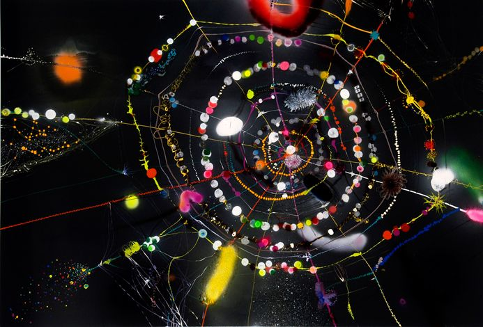

<!-- ═══════════════════════════════════════════════════════════ -->
<!-- if you're reading my source code... hi bestie 👾         -->
<!-- ═══════════════════════════════════════════════════════════ -->

<div align="center">

```
⠀⠀⠀⠀⠀⠀⠀⠀⠀⠀⠀⠀⠀⠀⠀★⠀⠀⠀⠀⠀⠀⠀⠀⠀⠀⠀⠀
⠀⠀⠀⠀⠀⠀⠀⠀⠀⠀⠀⠀⠀⠀⠀⠀⠀⠀⠀✦⠀⠀⠀⠀⠀⠀⠀
⠀⠀⠀✧⠀⠀⠀⠀⠀⠀⠀⠀⠀⠀⠀⠀⠀⠀⠀⠀⠀⠀⠀✦⠀⠀⠀
⠀⠀⠀⠀⠀⠀⠀⠀⠀✦⠀⠀⠀⠀⠀⠀⠀⠀⠀⠀⠀⠀⠀⠀⠀⠀⠀
```

# `akshatha.dungi` 🛸

**`software engineer` · `ai/ml` · `building things that explain themselves`**

<h1 align="center">🚀 Akshatha Dungi</h1>
<h3 align="center">Software Engineer | AI/ML Engineer | Building Intelligent Systems</h3>

<p align="center">
  
</p>

---

## 🌠

<p align="center">
  
</p>

---

## 🧠 About Me

- 🎓 CSE @ Andhra University (CGPA: 8.96) :contentReference[oaicite:0]{index=0}  
- 🔬 Research Intern @ ISI Kolkata (IDEAS Foundation) :contentReference[oaicite:1]{index=1}  
- ⚡ Built ANN models with **97% accuracy** :contentReference[oaicite:2]{index=2}  
- 🧠 Focus: **Neural Networks, Calibration, Time Series**
- ⚙️ Strong in **Backend + AI integration**
- 🌌 I build systems that *don’t just predict — they explain*

---

## 🌌 System Thinking

<p align="center">
  
</p>

> Complex systems aren’t chaotic — they’re just not understood yet.

---

## 🚀 Tech Stack

```bash
Languages      → Python | Java | JavaScript | SQL
AI/ML          → TensorFlow | PyTorch | Scikit-learn | RNN | LSTM
Backend        → Flask | Spring Boot | REST APIs
Frontend       → React | Responsive Design
DevOps/Cloud   → Docker | CI/CD | GitHub Actions | Azure