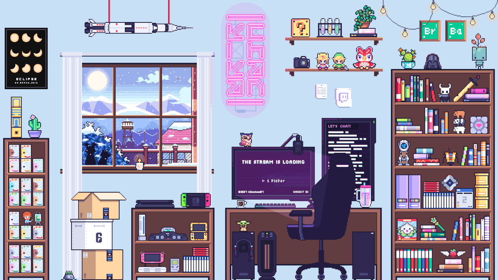

<!-- ═══════════════════════════════════════════════════════════ -->
<!-- if you're reading my source code... hi bestie 👾         -->
<!-- ═══════════════════════════════════════════════════════════ -->

<div align="center">

```
⠀⠀⠀⠀✦⠀⠀⠀⠀⠀⠀✧⠀⠀⠀⠀★⠀⠀⠀⠀⠀⠀★⠀⠀⠀⠀⠀✧         ⠀✦⠀⠀⠀⠀⠀⠀⠀⠀⠀⠀⠀⠀✧⠀⠀⠀⠀⠀✦⠀⠀✦⠀⠀✦⠀⠀⠀⠀⠀⠀✧⠀⠀⠀⠀★⠀⠀⠀⠀⠀⠀★⠀⠀⠀⠀⠀✧  
⠀⠀⠀⠀⠀⠀★⠀⠀⠀⠀⠀★⠀⠀⠀⠀⠀✧⠀⠀⠀⠀★⠀⠀⠀✦⠀⠀⠀⠀⠀⠀✧⠀⠀⠀✦⠀★⠀ ⠀✦⠀⠀✦
⠀⠀⠀✧⠀⠀⠀⠀⠀⠀⠀⠀⠀⠀⠀⠀⠀★⠀⠀⠀⠀⠀⠀⠀✦⠀★⠀ ⠀✦⠀⠀✦⠀⠀⠀⠀⠀⠀✧⠀⠀⠀⠀✦⠀⠀✦⠀⠀⠀⠀⠀⠀✧⠀⠀⠀⠀★⠀⠀⠀⠀⠀⠀★⠀⠀⠀⠀⠀✧  
⠀⠀⠀⠀⠀⠀⠀⠀⠀✦⠀⠀⠀⠀⠀⠀⠀⠀⠀⠀⠀⠀✧⠀⠀⠀⠀⠀✦⠀⠀⠀⠀⠀⠀⠀★⠀⠀⠀⠀⠀★⠀⠀⠀⠀⠀✧⠀⠀⠀⠀★⠀⠀⠀✦⠀⠀⠀⠀⠀⠀✧         ⠀⠀⠀⠀⠀⠀★⠀⠀⠀⠀⠀★⠀⠀⠀⠀⠀✧⠀⠀⠀⠀★⠀⠀⠀✦⠀⠀⠀⠀⠀⠀✧⠀⠀⠀✦⠀★⠀
```

<!-- ================= HEADER ================= -->

<h1 align="center">Akshatha Dungi</h1>
<h3 align="center">Software Engineer | AI/ML Systems Engineer</h3>

<p align="center">
  
</p>

<p align="center">
  <a href="#projects">Projects</a> •
  <a href="#tech-stack">Tech Stack</a> •
  <a href="#systems">Systems</a> •
  <a href="#contact">Contact</a>
</p>

---

<p align="center">
  
</p>

---

## About

- Computer Science @ Andhra University (CGPA: 9.07)
- Academic Excellence Award Recipient
- Experience- Research Intern @ ISI Kolkata  


> Focus: building systems that are **correct, scalable, and reliable under real-world conditions**

---

<a name="systems"></a>

## Systems Perspective

- Status        : Learning
- Current Task  : Building AI systems
- Runtime       : Coffee dependent
- Failure Mode  : Overengineering side projects

---

<a name="tech-stack"></a>

## Tech Stack

### Core
<p>
  
</p>

### AI / ML
<p>
  
  
</p>

### Backend
<p>
  
</p>

### Frontend
<p>
  
</p>

### DevOps
<p>
  
</p>

---

<a name="projects"></a>

## Selected Projects

### AI Confidence Calibration System

- Evaluated **5 neural architectures** on financial time-series  
- Built unified pipeline handling **160K+ records**  
- Achieved **3.34% Expected Calibration Error (ECE)**  
- Identified **predictable failure dynamics in RNN vs LSTM**

**Impact**
- Moves beyond accuracy → ensures **trustworthy AI predictions**
- Bridges research insights with deployable systems

---

### ML Pipeline Engineering System

- Designed **reproducible ML pipelines**
- Implemented evaluation + visualization layers
- Focused on **production-readiness and maintainability**

---

### End-to-End Classification System

- Built full pipeline: ingestion → preprocessing → modeling → evaluation  
- Emphasized interpretability and structured workflows  

---

## GitHub Analytics

<p align="center">
  
  
</p>

---

<a name="contact"></a>

## Contact

<p align="center">
  <a href="mailto:akshathadungi04@gmail.com">Email</a> •
  <a href="https://linkedin.com/in/akshathadungi2212">LinkedIn</a> •
  <a href="https://github.com/Akshatha-22">GitHub</a>
</p>

---

## Philosophy

Reliability > Accuracy  
Systems > Models  
Execution > Ideas
